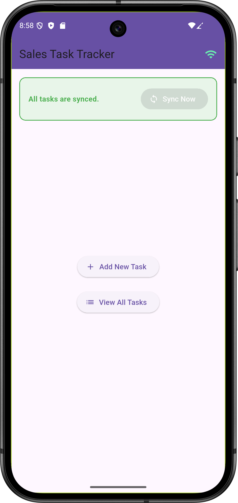
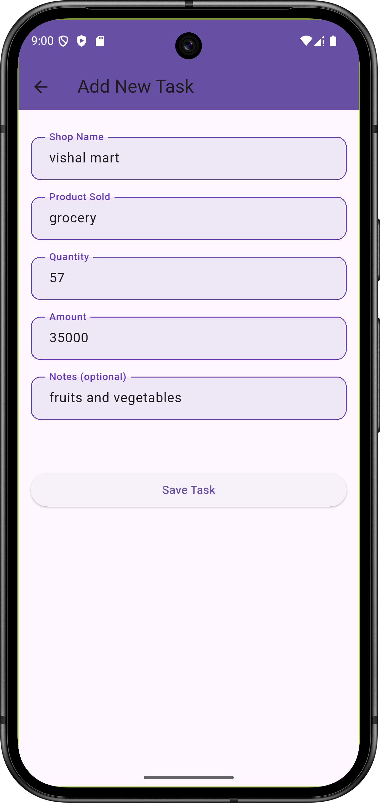
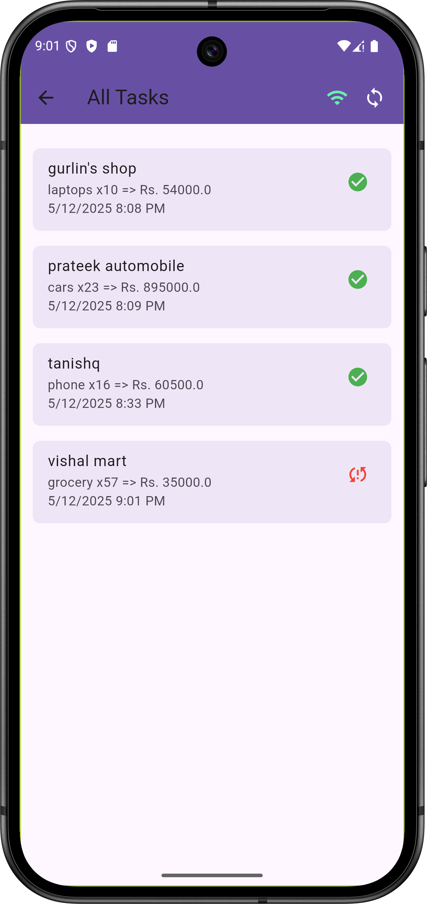
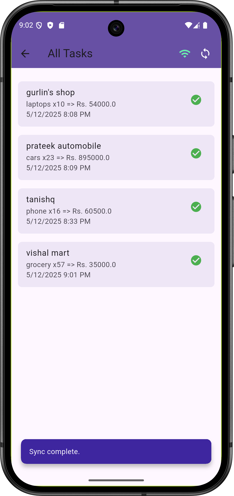
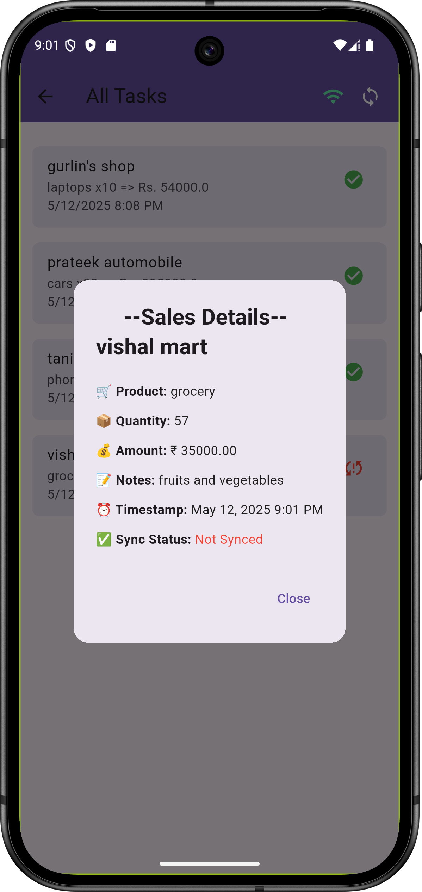

# 📱 Sales Task Tracker App

A Flutter mobile app for field salespersons to **log tasks offline** and **sync data to Firebase Firestore** when online.

---

## 🚀 Features

- **Offline-first**: Tasks are stored locally using SQLite.
- **Manual Sync**: Upload unsynced tasks to Firestore when network is available.
- **Sync Status**: View which tasks are synced or pending.
- **Connectivity Detection**: App detects online/offline status in real-time.
- **Clean UI**: Simple dashboard, add-task form, task list, and detail view.

---

## 📲 User Flow

1. Salesperson opens the app and lands on the **Dashboard**.
2. Taps **"Add New Task"** to log:
    - Shop Name
    - Product Sold
    - Quantity
    - Amount
    - Optional Notes
    - Timestamp (auto-filled)
3. The task is saved **locally first**.
4. Taps **"View All Tasks"** to check sync status.
5. When internet is available, taps **"Sync Now"** to upload unsynced tasks to Firebase.

---

## 📸 Screenshots

| Dashboard | Add Task | Task List |
|:---------:|:--------:|:---------:|
|  |  |  |

| Task Syncing | Task Details |
|:------------:|:------------:|
|  |  |


---

## 📦 Tech Stack

- **Flutter**
- **Firebase Firestore**
- **SQLite (sqflite)**
- **connectivity_plus**
- **floating_snackbar**

---

## 🛠️ Setup Instructions

1. **Clone this repo**:
   ```bash
   git clone https://github.com/Kartikey2011yadav/sales_task_tracker.git
   cd sales_task_tracker
